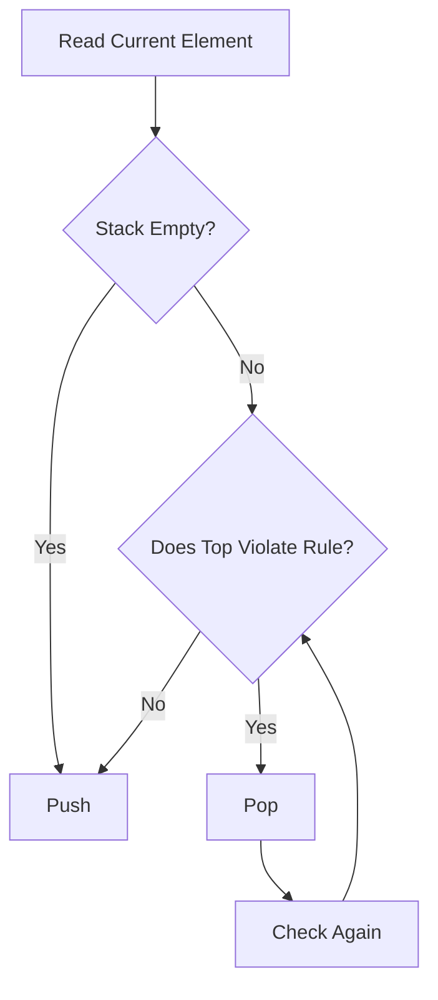

# Monotonic Stack

## What is a Monotonic Stack?

A Monotonic Stack is **not a different data structure**.

It is just a **normal stack** maintained in a particular order throughout the algorithm.

Depending on the problem, the stack is maintained as either

- Monotonically Increasing
- Monotonically Decreasing

The stack property itself never changes.

Only the way we **push and pop** changes.

---

# My Intuition

Initially, I thought

> "Monotonic Stack means I should always keep the stack sorted."

That wasn't completely correct.

Later I realized

The stack is **not sorted from the beginning**.

Instead,

every incoming element decides whether the stack should change.

The current element asks

```text
Should the previous element stay?

or

Should I replace it?
```

If the previous element is no longer useful,

remove it.

Otherwise,

keep it.

That is the real intuition.

---

# My Mental Model

Whenever a new element arrives,

I compare it with the stack top.

```text
Current Element

        │
        ▼

Top

┌─────┐
│  ?  │
├─────┤
│ ... │
└─────┘
```

Now I ask

```text
Can both elements exist together?

YES

↓

Push

NO

↓

Pop

↓

Check Again
```

This continues until the stack becomes valid again.

Then only the current element is pushed.

---

# What I Learned

The stack itself is **never the goal**.

The stack is only helping me answer

- Previous Greater
- Previous Smaller
- Next Greater
- Next Smaller

or

maintain the best possible candidates.

---

# Increasing Monotonic Stack

Every new element should be

greater than or equal to

the stack top.

Example

```text
Incoming

1

Stack

1
```

Incoming

```text
4
```

```text
4 > 1

Push
```

Stack

```text
Top

4
1
```

Incoming

```text
3
```

Now

```text
Top = 4

4 > 3
```

4 violates increasing order.

Pop

Stack

```text
1
```

Now

```text
1 < 3

Push
```

Final

```text
Top

3
1
```

---

# Decreasing Monotonic Stack

Now every new element should be

smaller than or equal to

the stack top.

Example

```text
Top

8
5
3
```

Incoming

```text
6
```

Since

```text
3 < 6
```

Remove

```text
3
```

Again

```text
5 < 6
```

Remove

Finally

```text
8 > 6
```

Push

Final

```text
Top

6
8
```

---

# My Biggest Mistake

While solving **Remove K Digits**

I thought

```text
Whenever

Top > Current

↓

Pop
```

That logic looked correct.

But I forgot

```text
Only k removals are allowed.
```

Because of that,

I kept popping even after all removals were exhausted.

---

# My Correction

I realized

Every pop means

```text
One removal.
```

Therefore

Every pop should decrease `k`.

Once

```text
k = 0
```

No more popping is allowed,

even if the monotonic property is violated.

This was the biggest learning point for me.

---

# How I Now Think

Whenever I see a monotonic stack problem,

I immediately ask myself

```text
1.

What should the stack represent?

Previous elements?

Candidates?

Indices?

Values?

↓

2.

Should it be

Increasing

or

Decreasing?

↓

3.

When should an element be removed?

↓

4.

Does the problem have an extra condition?

Example

k > 0

Window size

Current index

etc.
```

Only then do I start solving.

---

# ASCII Visualization

Incoming

```text
5
```

Current Stack

```text
Top

4
3
2
```

Since

```text
4 < 5
```

Pop

```text
Top

3
2
```

Still

```text
3 < 5
```

Pop

Finally

Push

```text
Top

5
2
```

---

# Mermaid Diagram



---

# Time Complexity

```text
O(n)
```

## Why?

Each element

- enters the stack once
- leaves the stack at most once

Therefore

```text
Pushes = n

Pops ≤ n
```

Total operations

```text
2n

↓

O(n)
```

---

# Space Complexity

```text
O(n)
```

The stack may contain every element.

---

# Common Mistakes

❌ Thinking Monotonic Stack is a separate data structure.

---

❌ Trying to sort the stack manually.

---

❌ Forgetting the extra conditions of the problem
(example: `k > 0`, window limits, indices).

---

❌ Popping only once instead of repeatedly checking the top.

---

❌ Storing values when the problem actually needs indices.

---

# Interview Tips

### First Question

Ask yourself

```text
What should the stack store?

Values?

Indices?
```

---

### Second Question

Should the stack be

```text
Increasing

or

Decreasing?
```

---

### Third Question

When should an element leave the stack?

The answer to this usually reveals the while-loop condition.

---

# My Key Takeaways

- Monotonic Stack is just a normal stack with a maintained order.
- The current element decides whether previous elements should remain.
- Keep popping until the stack becomes valid again.
- Always check for additional constraints from the problem (like `k > 0`).
- Don't memorize patterns—understand **why** elements are removed.
