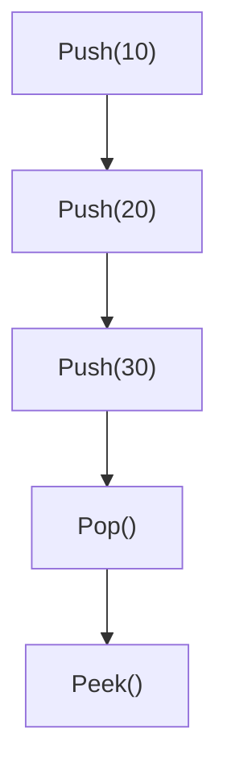

# Stack Basics (Python)

## What is a Stack?

A **Stack** is a linear data structure that follows the **LIFO (Last In, First Out)** principle.

> The last element inserted is the first one to be removed.

Think of it as a stack of plates.

```text
Push Plates

    ┌─────┐
Top │  5  │
    ├─────┤
    │  4  │
    ├─────┤
    │  3  │
    ├─────┤
    │  2  │
    ├─────┤
    │  1  │
    └─────┘

Pop

Remove

5
```

---

# Pattern Recognition

Used in

- Monotonic Stack
- DFS
- Undo/Redo
- Browser History
- Parentheses Matching
- Expression Evaluation
- Function Call Stack
- Backtracking

---

# Intuition

A stack allows access to **only one element**:

```text
Top
```

You cannot directly remove or access elements in the middle.

```text
      Top
       │
       ▼

    ┌─────┐
    │  40 │  ← Accessible
    ├─────┤
    │  30 │
    ├─────┤
    │  20 │
    ├─────┤
    │  10 │
    └─────┘
```

If you need `20`, first remove

```text
40

↓

30

↓

20
```

---

# Construction (Python)

Python Stack is implemented using a **List**.

```text
stack = []
```

Initially

```text
Top

┌─────┐
│     │
└─────┘

Empty Stack
```

---

# Stack Operations

## 1. Push

Insert an element at the top.

### Example

Push 10

```text
Before

┌─────┐
│     │
└─────┘
```

↓

```text
After

┌─────┐
│ 10  │
└─────┘
```

---

Push 20

```text
┌─────┐
│ 20  │
├─────┤
│ 10  │
└─────┘
```

---

Push 30

```text
Top
 │
 ▼

┌─────┐
│ 30  │
├─────┤
│ 20  │
├─────┤
│ 10  │
└─────┘
```

---

## 2. Pop

Removes the top element.

Initial

```text
Top

┌─────┐
│ 30  │
├─────┤
│ 20  │
├─────┤
│ 10  │
└─────┘
```

↓

Pop

↓

```text
Top

┌─────┐
│ 20  │
├─────┤
│ 10  │
└─────┘
```

Removed

```text
30
```

---

## 3. Peek / Top

Returns the top element.

Stack

```text
Top

┌─────┐
│ 20  │
├─────┤
│ 10  │
└─────┘
```

Peek

```text
20
```

Nothing is removed.

---

## 4. isEmpty()

Checks whether the stack contains any elements.

Example

```text
┌─────┐
│     │
└─────┘

True
```

---

Example

```text
┌─────┐
│ 10  │
└─────┘

False
```

---

## 5. Size

Returns number of elements.

```text
┌─────┐
│ 30  │
├─────┤
│ 20  │
├─────┤
│ 10  │
└─────┘

Size = 3
```

---

# Operation Summary

| Operation | Description | Time |
|------------|-------------|------|
| Push | Insert at top | O(1) |
| Pop | Remove top | O(1) |
| Peek | View top | O(1) |
| isEmpty | Check empty | O(1) |
| Size | Count elements | O(1) |

---

# Dry Run

Initial

```text
Stack

Empty
```

Push(10)

```text
┌─────┐
│ 10  │
└─────┘
```

Push(20)

```text
┌─────┐
│ 20  │
├─────┤
│ 10  │
└─────┘
```

Push(30)

```text
┌─────┐
│ 30  │
├─────┤
│ 20  │
├─────┤
│ 10  │
└─────┘
```

Pop()

```text
Removed = 30

┌─────┐
│ 20  │
├─────┤
│ 10  │
└─────┘
```

Peek()

```text
20
```

Push(40)

```text
┌─────┐
│ 40  │
├─────┤
│ 20  │
├─────┤
│ 10  │
└─────┘
```

---

# ASCII Visualization

```text
Push

        30
        │
        ▼

┌─────┐
│ 30  │
├─────┤
│ 20  │
├─────┤
│ 10  │
└─────┘
```

---

```text
Pop

┌─────┐
│ 30  │
├─────┤
│ 20  │
├─────┤
│ 10  │
└─────┘

        │
        ▼

Removed
```

---

# Mermaid Diagram



---

# Time Complexity

| Operation | Complexity |
|-----------|------------|
| Push | O(1) |
| Pop | O(1) |
| Peek | O(1) |
| Size | O(1) |
| isEmpty | O(1) |

---

# Space Complexity

```text
O(n)
```

where **n** is the number of elements stored in the stack.

---

# Common Mistakes

❌ Calling `pop()` on an empty stack.

---

❌ Accessing the top element without checking if the stack is empty.

---

❌ Confusing FIFO (Queue) with LIFO (Stack).

---

❌ Trying to access elements in the middle of the stack directly.

---

# Interview Tips

### Why is Stack called LIFO?

Because the **Last Inserted Element** is removed **First**.

---

### Why is Push O(1)?

The element is inserted only at the end (top).

---

### Why is Pop O(1)?

Only the top element is removed.

---

### Why use Python List as Stack?

Appending and removing from the end of a Python list are amortized **O(1)** operations, making it a simple and efficient stack implementation.

---

### When should I think of a Stack?

Look for problems involving:

- Previous element
- Next greater/smaller element
- Undo operations
- Balanced brackets
- DFS
- Backtracking
- Expression evaluation
- Monotonic Stack

---

# Key Takeaways

- Stack follows **LIFO (Last In, First Out)**.
- Only the **top** element can be accessed directly.
- Python stacks are commonly implemented using a **list**.
- `push`, `pop`, and `peek` all work in **O(1)** time.
- Many advanced problems (e.g., Monotonic Stack, DFS, Parentheses Matching) build upon these basic operations.